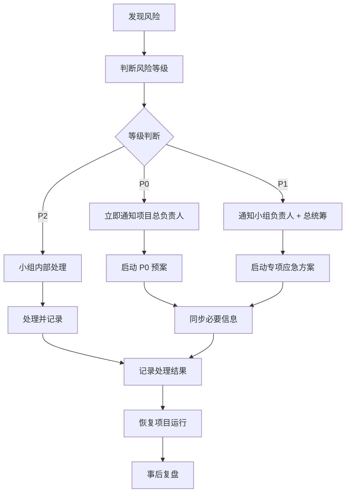

---
AI_NAVIGATION:
  block_purpose: "AI 文档路由；不面向人类阅读。"
  document_role: "项目风险识别、分级、响应和复盘规则"
  read_when:
    - "用户询问风险等级、风险处理流程或应急预案"
    - "用户描述数据泄露、医学伦理、舆情、安全、评审争议等异常事件"
    - "用户需要判断 P0、P1、P2 风险及责任角色"
  do_not_use_as:
    - "常规项目介绍"
    - "某个小组的日常执行清单"
  section_routes:
    "风险文档用途": "01. 文档目标"
    "风险处理原则": "02. 风险管理原则"
    "P0、P1、P2 风险等级判断": "03. 风险等级定义"
    "发现风险后的处理步骤": "04. 风险处理流程"
    "风险负责人和责任机制": "05. 风险责任机制"
    "人员、数据、技术、会务、医学伦理、传播、评审风险": "06. 风险清单"
    "第一期真实风险案例": "07. 第一期风险案例沉淀"
    "数据泄露、医疗伦理、舆情、重大安全事件": "08. 紧急事件响应机制（P0 预案）"
    "如何记录风险": "09. 风险记录模板"
    "如何做风险复盘": "10. 风险复盘机制"
  related_documents:
    - "02_筹备手册/01_项目总统筹.md"
---
# 风险管理与应急预案

## 01. 文档目标

本文档用于识别罕见病基因黑客松项目执行过程中的关键风险，并明确风险等级、处置流程和责任人，保障项目稳定运行。

风险管理不是为了保证风险不发生，而是在风险发生后快速判断、快速止损、快速恢复运行，降低风险对患者、数据、医学边界、现场秩序和项目交付的损害。

## 02. 风险管理原则

### 2.1 提前暴露原则

风险越早发现，处理成本越低。

任何成员发现异常苗头，都应先上报、再判断，不因“不确定是不是风险”而延迟同步。

### 2.2 单点负责原则

每项风险必须有唯一负责人。

一个风险可以多人协助处理，但只能有一个负责人组织处置，也只能有一个决策人做最终判断。

### 2.3 分级响应原则

不同等级风险采用不同处理方式。

P0 必须立即升级到项目总负责人；P1 由小组负责人和总统筹联合处理；P2 由小组内部处理并记录。

### 2.4 信息透明原则

重大风险必须及时同步。

凡涉及患者隐私、基因数据、医学伦理、现场安全、公开传播、评审公平的事项，不允许只在小范围内私下处理。

### 2.5 先恢复运行原则

风险发生后，优先恢复项目主线运行，再复盘原因。

现场处置时先保证患者安全、数据安全、人员安全和核心流程继续推进，活动结束后再系统复盘。

## 03. 风险等级定义

### P0｜项目中断级

影响：

* 项目无法继续进行。
* 出现医疗、伦理、患者安全或数据安全重大问题。
* 出现核心数据泄露、患者隐私暴露、严重舆情或现场安全事件。

示例：

* 核心基因数据、临床资料、患者身份信息泄露。
* 未授权人员获取病例档案或持续骚扰患者。
* 场地无法使用，活动主体流程中断。
* 大规模系统故障，所有队伍无法访问数据或平台。
* 对外传播将分析线索错误表述为临床诊断，并已造成扩散。

处理：

* 立即升级至项目总负责人。
* 相关流程可以先暂停，后补记录。
* 总负责人、风险所属小组负责人和必要专业负责人共同处置。

### P1｜重大影响级

影响：

* 部分核心功能无法运行。
* 影响核心体验、评审公平、赛手进度或专家参与。
* 如不处理，可能升级为 P0。

示例：

* 关键嘉宾或评委无法到场。
* 某批数据不可用或关键字段缺失。
* 大量赛手退出或团队结构失衡。
* 数据下载过慢，影响多支队伍分析。
* 未登记人员进入队伍并接触数据，但尚未造成泄露。
* 评选结果可能引发明显争议。

处理：

* 小组负责人和总统筹联合处理。
* 必须记录处置过程和影响范围。
* 必要时同步相关小组负责人。

### P2｜一般问题级

影响：

* 可由小组自行修复。
* 不影响整体推进。
* 不涉及数据安全、患者隐私、医学伦理或项目主线。

示例：

* 物料缺失。
* 沟通延迟。
* 单个志愿者迟到。
* 局部设备小故障。
* 少量赛手签到信息需补录。

处理：

* 小组内部处理并记录。
* 若连续发生或影响扩大，升级为 P1。

## 04. 风险处理流程



标准流程：

1. 发现风险。
2. 判断等级。
3. 通知负责人。
4. 启动预案。
5. 同步信息。
6. 记录结果。
7. 恢复运行。
8. 事后复盘。

## 05. 风险责任机制

| 角色 | 职责 |
|---|---|
| 发现人 | 第一时间上报风险，说明发生时间、地点、涉及人员、已知影响和是否仍在持续。 |
| 负责人 | 组织处理风险，调动相关人员，确保处置动作执行到位。 |
| 决策人 | 做最终决策，包括暂停、恢复、升级、对外回应、是否更改流程。 |
| 记录人 | 留痕归档，记录风险等级、处理过程、决策依据、影响范围和复盘结论。 |

责任要求：

* 一个风险可以多人处理，但必须只有一个决策人。
* P0 风险的默认决策人为项目总负责人。
* P1 风险的默认决策人为总统筹或被授权的小组负责人。
* P2 风险的默认决策人为小组负责人。
* 记录人可以由运营或对应小组成员担任，但必须在当日完成记录。

## 06. 风险清单

### 6.1 人员风险

| 风险类别 | 具体风险 | 等级 | 负责人 | 预防措施 | 应急方案 |
|---|---|---|---|---|---|
| 人员风险 | 未报名人员到现场强行参赛 | P1/P0 | 赛手组负责人、现场负责人 | 开赛前明确报名截止、入场规则、赛手名单、协议签署要求 | 现场运营出面沟通；未通过资格确认不得参赛；如骚扰患者或索要病例，立即升级 P0 并安排安全人员介入 |
| 人员风险 | 不具备专业能力的人持续接触患者或索要病例资料 | P0 | 总负责人、患者接待负责人 | 患者接待专人负责；明确赛手不得直接向患者索要资料 | 立即隔离当事人与患者接触；由运营人员正式沟通；必要时安排现场安全人员守护关键入口 |
| 人员风险 | 已组队团队临时加入新成员 | P1 | 赛手组负责人 | 团队名单每日核对；进入数据平台前必须签署协议 | 重新清点人数和保密协议；找到新增人员补签协议并完成数据使用告知；记录变更 |
| 人员风险 | 嘉宾或评委临时取消 | P1 | 嘉宾与评审组负责人 | 准备替补专家、线上参与方案、异步评审机制 | 启用替补或线上评审；必要时调整评审时间 |
| 人员风险 | 赛手大规模退出 | P1 | 赛手组负责人 | 提前确认到达情况和队伍结构 | 合并队伍、调整任务目标、重新分配病例 |
| 人员风险 | 志愿者缺席 | P2 | 会务组负责人 | 设置机动志愿者和岗位备份 | 合并低优先级岗位，保障签到、接待、设备、餐饮等关键岗位 |
| 人员风险 | 核心成员生病或无法到场 | P1 | 总负责人 | 每个关键岗位设置副手 | 由副手接管；总负责人重新分配权限和信息流 |

### 6.2 数据风险

| 风险类别 | 具体风险 | 等级 | 负责人 | 预防措施 | 应急方案 |
|---|---|---|---|---|---|
| 数据风险 | 数据泄露或未授权外传 | P0 | 数据与技术组负责人 | 平台权限控制、导出监控、保密协议、最小权限原则 | 冻结相关账号和权限；停止相关数据流转；保留日志；通知总负责人；评估是否需要对外说明 |
| 数据风险 | 患者直接向赛手发送未脱敏资料 | P0 | 患者接待负责人、数据负责人 | 提前告知患者补充资料必须交由主办方处理 | 停止传播；要求赛手删除未授权资料；主办方重新收集、脱敏、分发 |
| 数据风险 | 数据缺失或关键字段不完整 | P1 | 数据负责人、案例负责人 | T-30 前完成数据规格清单；提前确认参考基因组版本 | 标注限制；联系医生补充；必要时降低该病例分析目标或暂停该病例 |
| 数据风险 | 样本编号、家系关系或参考基因组版本错误 | P1 | 数据负责人 | 多人复核；样本对应表单独维护 | 暂停该病例分析；修正说明后统一通知赛手 |
| 数据风险 | 数据权限异常 | P1/P0 | 平台负责人 | 账号分级、访问日志、导出预警 | 立即调整权限；若已接触敏感数据则升级 P0 |
| 数据风险 | 数据太大导致下载缓慢 | P1 | 平台负责人 | 提前预传数据；准备 OSS 文档；现场避免大规模临时下载 | 限制重复下载；提供统一数据路径；启用本地缓存或分批访问 |

### 6.3 技术风险

| 风险类别 | 具体风险 | 等级 | 负责人 | 预防措施 | 应急方案 |
|---|---|---|---|---|---|
| 技术风险 | 现场网络故障或带宽不足 | P1 | 数据与技术组负责人、会务负责人 | 同规模建议准备 1000M 带宽；T-1 完成压力测试 | 降低下载并发；启用备用网络；优先保障数据访问和报告提交 |
| 技术风险 | GPU 或算力不可用 | P1 | 平台负责人 | 提前确认 CPU、内存、数据盘、GPU 配置 | 调整分析任务；优先保障可用工具；必要时改为轻量分析 |
| 技术风险 | 环境配置失败 | P1/P2 | 技术支持负责人 | 预装 Python、CUDA、samtools、GATK、VEP 等常用工具 | 统一修复镜像；提供替代工具或容器 |
| 技术风险 | OSS 连接失败 | P1 | 平台负责人 | 提前发布连接文档和 VPN 提醒 | 现场集中排查；多队同时失败则升级平台问题 |
| 技术风险 | Git 仓库、代码提交或成果归档异常 | P2 | 赛手组技术联络人 | 提前定义提交方式和备份方式 | 允许临时用压缩包或共享盘补交，赛后再归档 |
| 技术风险 | 报告提交平台不可用 | P1 | 赛手组负责人、平台负责人 | 准备备用提交渠道 | 启用微信群、邮箱或共享盘临时提交，并记录时间戳 |

### 6.4 会务风险

| 风险类别 | 具体风险 | 等级 | 负责人 | 预防措施 | 应急方案 |
|---|---|---|---|---|---|
| 会务风险 | 场地无法使用 | P0 | 会务负责人、总负责人 | 提前确认场地权限、备用区域、搭建时间 | 启用备用场地或压缩流程；必要时暂停现场活动 |
| 会务风险 | 电力问题 | P1 | 会务负责人 | 提前确认插座、电源排布、备用插排 | 优先保障平台设备、演示设备、网络设备 |
| 会务风险 | 投影、话筒、电脑损坏 | P1 | 设备负责人 | T-1 和演示前 30 分钟测试 | 启用备用设备；必要时改为本机展示或口头汇报 |
| 会务风险 | 餐饮数量不足或延误 | P2 | 餐饮负责人 | 每日按实际到场人数统计 | 临时补餐；调整下一餐数量 |
| 会务风险 | 物料缺失 | P2 | 会务负责人 | 物料清单逐项核对 | 临时打印、手写替代或调整使用顺序 |
| 会务风险 | 现场秩序被干扰 | P1/P0 | 现场负责人 | 设置入口引导、身份识别、关键区域负责人 | 现场运营先沟通；涉及患者安全或数据安全时升级 P0 |

### 6.5 医学与伦理风险

| 风险类别 | 具体风险 | 等级 | 负责人 | 预防措施 | 应急方案 |
|---|---|---|---|---|---|
| 医学与伦理风险 | 分析结果被误解为临床诊断 | P0 | 嘉宾与评审组负责人、总负责人 | 所有模板写明“分析线索，不构成诊断” | 立即纠正口径；修改报告和传播内容；必要时统一说明 |
| 医学与伦理风险 | 患者隐私暴露 | P0 | 患者接待负责人、数据负责人 | 患者材料单线收集；公开内容脱敏审核 | 停止传播；删除资料；通知总负责人；记录影响范围 |
| 医学与伦理风险 | 赛手直接向患者解释医学结果 | P1/P0 | 赛手组负责人、医学负责人 | 开赛前明确赛手不得给治疗建议 | 立即制止；由医学负责人重新说明边界 |
| 医学与伦理风险 | 患者被未授权人员持续打扰 | P0 | 患者接待负责人、现场负责人 | 患者接待专人陪同；限制病例资料访问 | 隔离风险人员；安排安全人员；必要时取消其参与资格 |
| 医学与伦理风险 | 案例成果归属不清 | P1 | 案例负责人、总负责人 | 病例纳入前确认共享边界 | 暂停公开或评奖使用，待确认后处理 |

### 6.6 传播风险

| 风险类别 | 具体风险 | 等级 | 负责人 | 预防措施 | 应急方案 |
|---|---|---|---|---|---|
| 传播风险 | 错误传播医学信息 | P0 | 传播负责人、医学负责人 | 医学内容发布前审核 | 立即撤回或修正；发布统一口径 |
| 传播风险 | 媒体报道失实 | P1 | 传播负责人 | 提供统一新闻口径和采访边界 | 联系媒体更正；总负责人判断是否公开回应 |
| 传播风险 | 未经授权使用患者照片或故事 | P0 | 传播负责人 | 采访和拍摄前确认授权 | 停止使用并撤回；向当事人说明处理结果 |
| 传播风险 | 拍到电脑屏幕中的敏感数据 | P0 | 摄影摄像负责人、数据负责人 | 明确不拍数据屏幕和报告细节 | 删除素材；已发布则撤回并评估影响 |
| 传播风险 | 评选争议被外部放大 | P1 | 传播负责人、评审负责人 | 提前明确评审规则和评分维度 | 统一回应评审机制，不讨论个人或队伍争执 |

### 6.7 评审风险

| 风险类别 | 具体风险 | 等级 | 负责人 | 预防措施 | 应急方案 |
|---|---|---|---|---|---|
| 评审风险 | 参赛者对评选结果不服 | P1 | 评审负责人、总负责人 | 提前发布评分维度；评委会前统一打分口径 | 公开解释评审流程和维度；不现场争辩个案分数；必要时复核记录 |
| 评审风险 | 评委时间过短导致判断粗糙 | P1 | 评审负责人 | 提前收报告，提前给评委工具和说明 | 延长评审或改为赛后补充评审 |
| 评审风险 | 演示时间不足 | P2 | 赛手组负责人、评审负责人 | 明确每队时长和倒计时机制 | 压缩非核心环节，保障每队最低展示时间 |
| 评审风险 | 报告质量差异过大难以比较 | P2 | 评审负责人 | 使用统一提交模板 | 评审时按统一维度比较，不以展示效果替代分析质量 |

## 07. 第一期风险案例沉淀

### 案例 1：未报名人员现场强行加入并索要患者病例

事件描述：

有一名未报名人员错过报名后到达现场，强烈要求加入比赛。经评估，其不具备相关专业和技术能力，但持续在现场寻找患者索要病例档案，患者难以招架。最终由项目运营人员出面处理，并在病例报告当天于门口安排 4 名男生做安全工作，防止其扰乱现场。

风险判断：

* 等级：P0。
* 类别：人员风险、医学与伦理风险、患者安全风险。
* 核心问题：未授权人员接触患者和病例资料，可能造成患者隐私暴露、现场秩序失控和医学伦理问题。

下次预防：

* 开赛前锁定参赛名单和入场规则。
* 未报名人员不得临时加入赛手体系。
* 患者必须有专人接待和保护。
* 任何人不得直接向患者索要病例资料。

应急方案：

* 现场运营第一时间沟通并劝离相关行为。
* 若继续接触患者或扰乱现场，升级至 P0。
* 安排现场安全人员保护患者动线和病例报告入口。
* 记录事件经过、处理人员、处理结果和后续影响。

### 案例 2：已组队团队临时加入新人，协议和数据告知缺失

事件描述：

已有团队临时加入新成员，因人数多，现场需要逐一识别。后来识别出新增人员后，重新清点人数和保密协议数量，找到该成员补充签署协议，并补充交代数据使用要求。

风险判断：

* 等级：P1。
* 类别：人员风险、数据风险。
* 核心问题：未完成协议签署和数据告知的人员可能接触敏感数据。

下次预防：

* 队伍名单必须有唯一版本。
* 每日清点团队成员和协议签署状态。
* 平台权限发放前必须完成协议签署。

应急方案：

* 暂停该新增人员的数据接触。
* 补签协议并完成数据使用告知。
* 更新队伍名单、协议数量和权限记录。

### 案例 3：数据过大，下载慢，算法和现场节奏受影响

事件描述：

数据量过大，现场算法和下载速度跟不上，赛手抱怨数据下载太慢，耽误了一部分分析时间。

风险判断：

* 等级：P1。
* 类别：数据风险、技术风险。
* 核心问题：数据分发方式和现场网络无法支撑多队并发分析。

下次预防：

* 赛前完成数据预传，不依赖现场临时下载。
* 同规模活动建议现场带宽至少 1000M。
* 提前做多队并发访问测试。
* 准备本地缓存或统一数据路径。

应急方案：

* 限制重复下载和大文件并发。
* 发布统一数据访问方式。
* 必要时调整分析目标或延长提交时间。

### 案例 4：评选结果可能引发“不服”

事件描述：

首届未发生明显评选争议，但存在潜在风险：参赛团队可能对评审结果、评分标准或展示时间不服。

风险判断：

* 等级：P1。
* 类别：评审风险、传播风险。
* 核心问题：评审标准不透明或评审过程太仓促，会影响项目公信力。

下次预防：

* 赛前发布评分维度。
* 提前给评委开说明会。
* 提前收分析报告，给评委更多判断时间。
* 评审记录留痕。

应急方案：

* 由评审负责人解释评审流程，不现场争论单项分数。
* 总负责人判断是否需要复核。
* 对外只解释机制，不放大队伍间比较。

## 08. 紧急事件响应机制（P0 预案）

### 8.1 数据泄露

谁负责：

* 第一负责人：数据与技术组负责人。
* 最终决策人：项目总负责人。
* 协助：平台负责人、赛手组负责人、传播负责人。

多久响应：

* 发现后 10 分钟内通知项目总负责人。
* 30 分钟内完成权限冻结、传播阻断或数据撤回。
* 2 小时内完成初步记录。

谁对外发声：

* 仅项目总负责人或其指定传播负责人可以对外发声。
* 技术人员、赛手、志愿者不得自行解释。

如何记录：

* 记录泄露时间、发现人、涉及数据、涉及人员、传播范围、已采取动作、后续补救和责任人。

### 8.2 医疗伦理事件

包括：

* 患者隐私暴露。
* 赛手向患者解释诊断或治疗建议。
* 未授权人员索要病例资料。
* 分析结果被包装为医学诊断。

谁负责：

* 第一负责人：嘉宾与评审组医学负责人或患者接待负责人。
* 最终决策人：项目总负责人。
* 协助：赛手组负责人、传播负责人、数据负责人。

多久响应：

* 发现后立即停止相关行为。
* 15 分钟内通知总负责人。
* 当日完成患者安抚、边界说明和事件记录。

谁对外发声：

* 医学口径由医学负责人确认。
* 对外表达由总负责人或传播负责人统一发布。

如何记录：

* 记录事件经过、涉及患者、涉及人员、是否有资料外传、是否造成误解、纠正动作和后续跟进。

### 8.3 舆情事件

包括：

* 媒体报道失实。
* 社交平台误读项目。
* 传播内容夸大医学结果。
* 评选争议被公开放大。

谁负责：

* 第一负责人：传播组负责人。
* 最终决策人：项目总负责人。
* 协助：医学负责人、评审负责人、数据负责人。

多久响应：

* 发现后 30 分钟内完成截图和初判。
* 1 小时内决定是否回应、撤回、修正或联系媒体。

谁对外发声：

* 传播负责人按总负责人确认口径发声。
* 任何小组不得单独在公开平台回应敏感问题。

如何记录：

* 记录舆情来源、传播范围、核心误读、处理方式、发布口径和后续影响。

### 8.4 重大安全事件

包括：

* 现场人员冲突。
* 患者、嘉宾、赛手或工作人员人身安全受威胁。
* 场地、电力、设备、天气等导致活动无法继续。

谁负责：

* 第一负责人：现场会务负责人。
* 最终决策人：项目总负责人。
* 协助：志愿者负责人、场地方联系人、患者接待负责人。

多久响应：

* 现场立即处置，优先保护人员安全。
* 10 分钟内通知总负责人。
* 30 分钟内决定是否暂停、转移或调整流程。

谁对外发声：

* 涉及公共说明时，由总负责人或指定传播负责人发声。
* 涉及场地方安全规则时，与场地方统一口径。

如何记录：

* 记录发生地点、涉及人员、现场处置、是否影响流程、是否需要后续追责或安抚。

## 09. 风险记录模板

```markdown
## 风险记录

* 风险编号：
* 发现时间：
* 发现人：
* 风险类别：
* 风险等级：P0 / P1 / P2
* 事件描述：
* 涉及人员：
* 影响范围：
* 当前状态：已发现 / 处理中 / 已恢复 / 待复盘
* 负责人：
* 决策人：
* 记录人：
* 已采取措施：
* 后续动作：
* 截止时间：
* 复盘结论：
```

## 10. 风险复盘机制

项目结束后，所有 P0、P1 风险必须进入复盘；高频 P2 风险也应进入复盘。

复盘问题：

* 风险是否发生？
* 为什么发生？
* 发现是否足够早？
* 风险等级判断是否准确？
* 预案是否有效？
* 负责人和决策人是否清晰？
* 信息同步是否及时？
* 是否影响患者、数据、医学边界、现场秩序或项目交付？
* 下一期如何优化？

输出文件：

* `风险复盘报告.md`
* `P0/P1 风险事件清单.xlsx`
* `风险预案更新记录.md`

《风险复盘报告》建议结构：

```markdown
# 风险复盘报告

## 1. 风险概览

## 2. 已发生风险列表

## 3. 未发生但高概率风险

## 4. P0/P1 事件复盘

## 5. 预案有效性评估

## 6. 下一期优化动作

## 7. 需要更新的 SOP 文件
```
